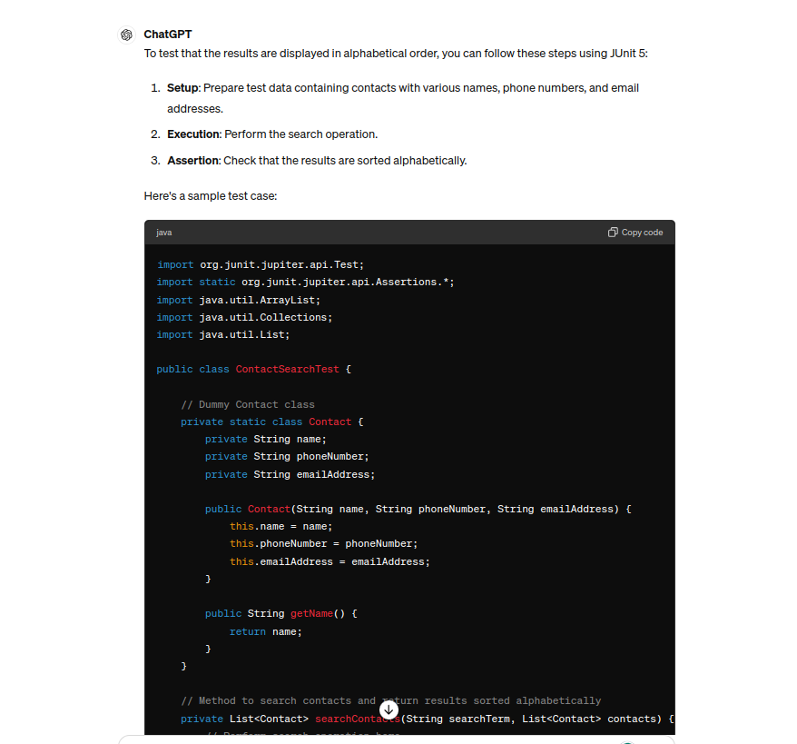
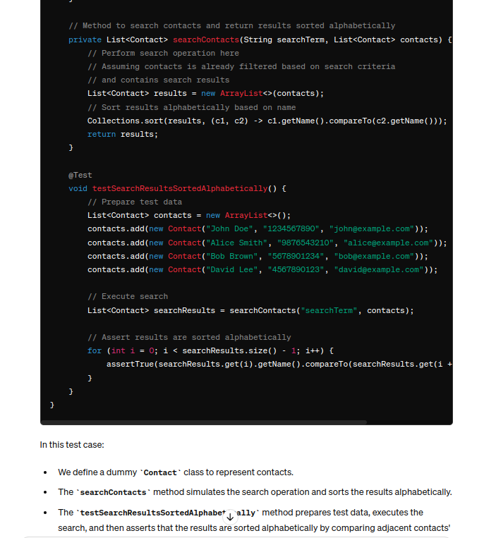
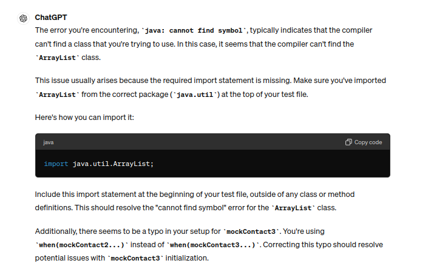

## Class Diagram for additional User Stories:

### Prompt:

### Response:

## Test Code Implementation for User Story 10

### Prompt:

### Response:

## Debugging user story 10: cannot find ArrayList Symbol class

## prompt:

## response:
