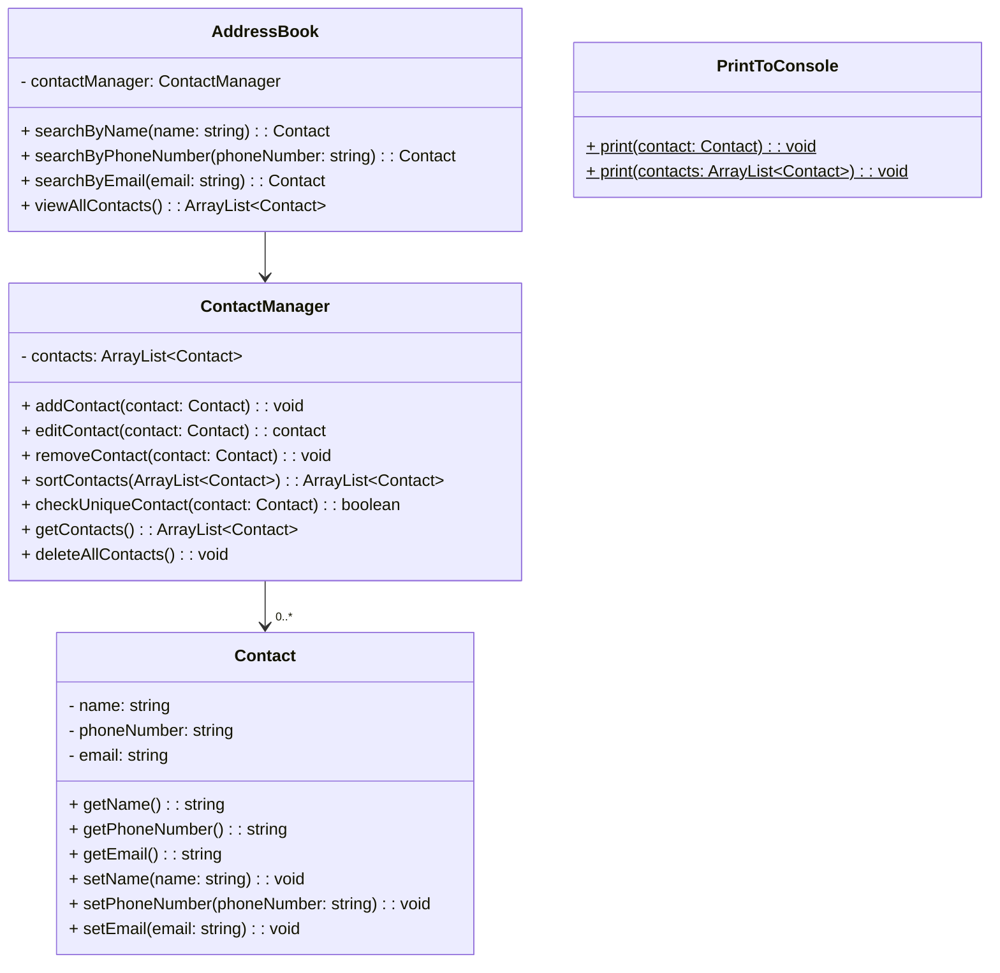

# Class Diagrams and Test Plan

## Class Diagram:

## Test Plan:

## User Story 1
**As a user, so that I can store my contacts, I would like to add a contact to the address book.**

#### Test Plan:
- [x] **Add Contact**: Add a contact to the address book. Expect the contact to be successfully added.

- [x] ***Add Contact with Empty Fields***: Attempt to add a contact with empty name, phone number, or email fields. Expect an error indicating that all fields are required.

## User Story 2
**As a user, so that I can easily identify my contacts, I would like each contact to have a name, phone number, and email address.**

#### Test Plan:
- [x] **Add Contact with Name, Phone Number, and Email Address**: Add a contact with a name, phone number, and email address. Expect the contact details to be correctly stored.
- [x] **Create Contact with Missing Information:** Attempt to create a contact with missing name, phone number, or email address. Expect an error indicating that all fields are required.

## User Story 3
**As a user, so that I can quickly find a specific contact, I would like to search for a contact by name and have the results displayed.**

#### Test Plan:
- [x] **Search by Name**: Search for a contact by name. Expect the contact with the specified name to be returned.
- [X] **Search for Non-Existent Name:** Search for a contact with a name that does not exist in the address book. Expect an empty result.

## User Story 4
**As a user, so that I can keep my address book updated, I would like to edit a contact's details.**

#### Test Plan:
- [x] **Edit Contact Details**: Edit the details of an existing contact. Expect the contact details to be successfully updated.
- [x] **Edit Non-Existent Contact:** Attempt to edit a contact that does not exist in the address book. Expect an error indicating that the contact does not exist.

## User Story 5
**As a user, so that I can remove outdated or incorrect contacts, I would like to remove a contact from the address book.**

#### Test Plan:
- [ ] **Remove Contact**: Remove a contact from the address book. Expect the contact to be successfully removed.
- [ ] **Remove Non-Existent Contact**: Attempt to remove a contact that does not exist in the address book. Expect an error indicating that the contact does not exist.

## User Story 6
**As a user, so that I can ensure contact uniqueness, I would like duplicate phone numbers or email addresses not to be allowed.**

#### Test Plan:
- [ ] **Add Contact with Duplicate Phone Number**: Attempt to add a contact with a phone number that is already assigned to another contact. Expect an error indicating that duplicate phone numbers are not allowed.
- [ ] **Add Contact with Duplicate Email Address**: Attempt to add a contact with an email address that is already assigned to another contact. Expect an error indicating that duplicate email addresses are not allowed.

## User Story 7
**As a user, so that I can view all my contacts at once, I would like to view all contacts in the address book.**

#### Test Plan:
- [ ] **View All Contacts**: Retrieve all contacts from the address book. Expect the list of contacts to be returned.
- [ ] **View Empty Address Book**: Attempt to view all contacts when the address book is empty. Expect an empty result.

## User Story 8
**As a user, so that I can search for a contact by phone number, I would like to search for a contact by phone number and have the results displayed.**

#### Test Plan:
- [ ] **Search by Phone Number**: Search for a contact by phone number. Expect the contact with the specified phone number to be returned.
- [ ] **Search for Non-Existent Phone Number**: Search for a contact with a phone number that does not exist in the address book. Expect an empty result.

## User Story 9
**As a user, so that I can search for a contact by email address, I would like to search for a contact by email address and have the results displayed.**

#### Test Plan:
- [ ] **Search by Email Address**: Search for a contact by email address. Expect the contact with the specified email address to be returned.
- [ ] **Search for Non-Existent Email Address**: Search for a contact with an email address that does not exist in the address book. Expect an empty result.

## User Story 10
**As a user, so that I can search for a contact by various criteria, I would like to search for a contact by name, phone number, or email address and have the results displayed in alphabetical order.**

#### Test Plan:
- [ ] **Search by Name in Alphabetical Order**: Search for a contact by name and expect the results to be sorted alphabetically.
- [ ] **Search by Phone Number in Alphabetical Order**: Search for a contact by phone number and expect the results to be sorted alphabetically.
- [ ] **Search by Email Address in Alphabetical Order**: Search for a contact by email address and expect the results to be sorted alphabetically.

## User Story 11
**As a user, so that I can clear my address book, I would like to delete all contacts at once, confirming that I want to do this before proceeding.**

#### Test Plan:
- [ ] **Delete All Contacts**: Delete all contacts from the address book. Expect the address book to be empty after deletion.
- [ ] **Cancel Deletion**: Attempt to delete all contacts but cancel the operation when prompted. Expect no contacts to be deleted.

